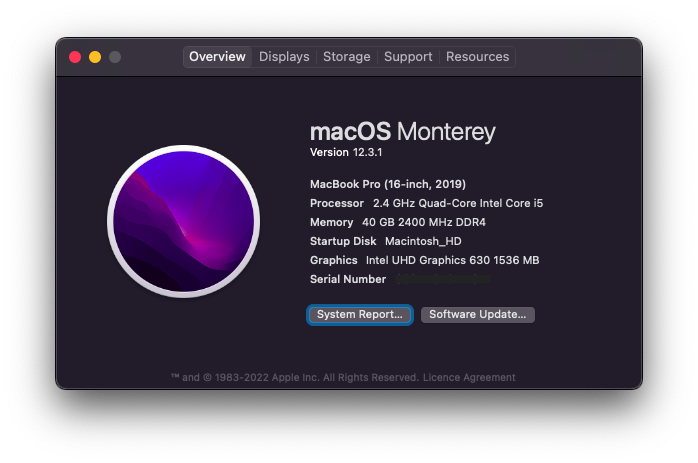
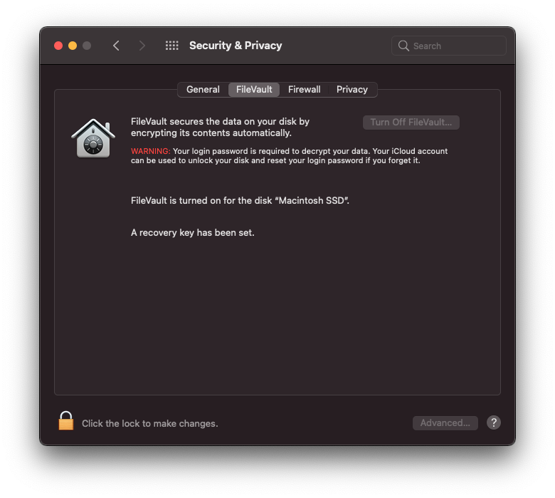
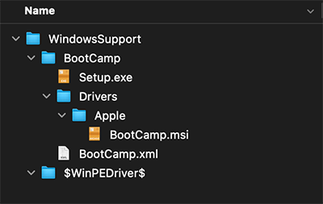
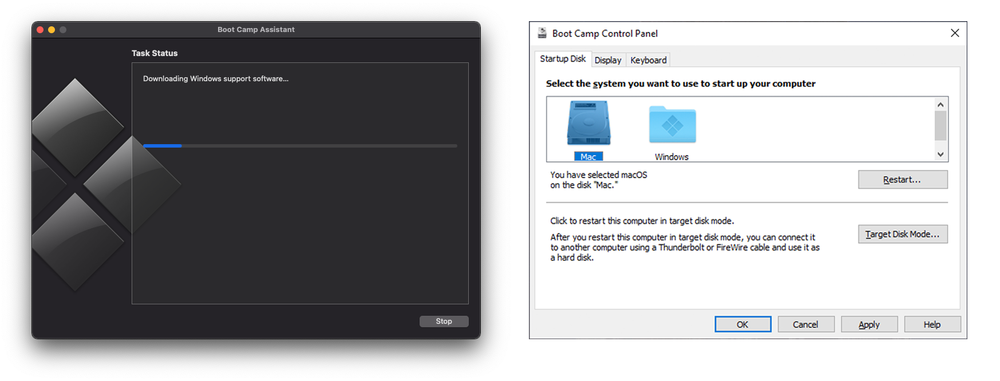

# Hackintosh

Installation guide for my Hackintosh build dual-booting macOS Monterey and Windows 11. This build is based on [Dortania's OpenCore Install Guide](https://dortania.github.io/OpenCore-Install-Guide/). The version numbers reported in this guide were the releases available at the time of installation and more than likely can be replaced with the latest iteration.




[](https://ko-fi.com/gnpaone)

## Table of Contents

* [The Build](#the-build)
* [Installation](#installation)
  * [USB Creation](#usb-creation)
  * [OpenCore Configuration](#opencore-configuration)
  * [BIOS Settings](#bios-settings)
  * [Install macOS](#install-macos)
* [Post Installation](#post-installation)
  * [Make macOS Drive Bootable](#make-macos-drive-bootable)
  * [Enable FileVault](#enable-filevault)
  * [Enable OpenCore GUI](#enable-opencore-gui)
  * [Disable verbosity and debugging](#disable-verbosity-and-debugging)
* [Dual-Boot Windows](#dual-boot-windows)
  * [Install Boot Camp Utilities](#install-boot-camp-utilities)
* [Signing Opencore bootloader](#signing-opencore-bootloader)
  * [Apple Secure Boot](#apple-secure-boot)
  * [Creating your own Secure Boot Keys](#creating-your-own-secure-boot-keys)
  * [Replacing UEFI keys](#replacing-uefi-keys)
* [Final OpenCore Configuration](#final-opencore-configuration)
* [Issues](#issues)
  * [Common Issues](#common-issues)
* [References](#references)
* [Resources](#resources)
* [Credits](#credits)


## The Build

| Specs | Details |
|------------|-------------------------------|
| Model | Asus Vivobook Gaming F571GT |
| Operating System | macOS Monterey && Windows 11  |
| Processor | Intel Core i5 7300HQ |
| Memory | Crucial 2x32GB DDR4 2666MHz |
| M.2 NVME SSD | Intel 660P SSDPEKNW512G8 512GB|
| 2.5" SATA SSD | Crucial CT1000MX500SSD1 1TB |
| Integrated Graphics | Intel UHD Graphics 630 |
| Dedicated Graphics | NVIDIA GeForce GTX 1650M |
| Sound Card | Realtek ALC255 |
| Wireless Card | Intel Wireless AX200 |
| Trackpad | ELAN 1200 |

__Tested and working__

- [x] Intel UHD Graphics 630
- [x] USB 3.0 + USB 2.0 + USB Type C
- [x] Webcam
- [x] LAN + Wifi + Bluetooth
- [x] M.2 and 2.5" SATA SSDs
- [x] Screen brightness
- [x] Battery status
- [x] Sleep/Wake
- [x] TouchPad with gestures
- [x] Internal SD Card Reader
- [x] Airdrop + Handoff
- [x] Audio (Speaker + Internal Mic + Headphone + External Mic)
- [x] Keyboard with backlight
- [x] FileVault

__Not working__

- [ ] NVIDIA GeForce GTX 1650M
- [ ] iServices
- [ ] HDMI + HDMI Audio
- [ ] and a few other minor bugs


## Installation

### USB Creation

Follow the OpenCore Install Guide to [create the macOS installer](https://dortania.github.io/OpenCore-Install-Guide/installer-guide/), [prepare the base OpenCore system](https://dortania.github.io/OpenCore-Install-Guide/installer-guide/opencore-efi.html), and [gather the necessary files to boot macOS](https://dortania.github.io/OpenCore-Install-Guide/ktext.html). The drivers, kexts, and SSDTs I used are present [here](EFI/OC)


### OpenCore Configuration

Follow the OpenCore Install Guide to [setup the initial config.plist file](https://dortania.github.io/OpenCore-Install-Guide/config.plist/) and [configure for Intel Laptop Coffee Lake Plus](https://dortania.github.io/OpenCore-Install-Guide/config-laptop.plist/coffee-lake-plus.html).

A sanitized version of my USB drive config file can be found [here](EFI/OC/config.plist).


### BIOS Settings

Enter **Advanced Mode** and **Load Optimized Defaults** to reset the default BIOS settings. Modify the following settings (may vary depending on BIOS version):

* Tweaker
  * Advanced CPU Settings
    * Virtualisation → **Enabled** (Enable if `DisableIoMapper` is set to `True` in [`config.plist'](EFI/OC/config.plist))
* Settings
  * IO Ports
    * SATA and RST Configuration
      * SATA Mode Selection → **ACHI** (if SATA drive used to boot into MacOS)
* Boot
  * Fast Boot → **Enabled** (Optional to disable)
  * Secure Boot
    * Secure Boot Enable → **Disabled** (Can be enabled if Opencore is [signed](#signing-opencore-bootloader))

Select **Save and Exit** to save the new BIOS settings


### Install macOS

_I performed the installation with the USB drive (with EFI folder), keyboard, and mouse plugged into one of the USB ports as my touchpad not working in my first install (v0.6.9)._

1. Restart computer and set the USB drive as the default BIOS boot device
2. Select the `Install macOS Monterey (external)` option from the OpenCore Boot Menu
3. Launch Disk Utility and format the destination drive
    * Name: `Macintosh HD`
    * Format: `APFS`
    * Scheme: `GUID Partition Map`
4. Launch Install macOS and select the `Macintosh HD` drive as the destination
    * As the system restarts, keep selecting `macOS Installer` from the OpenCore Boot Menu
5. Once the installation is complete, select `Macintosh HD` from the OpenCore Boot Menu and proceed through the normal macOS setup


## Post Installation

Based heavily on [Dortania's OpenCore Post-Install Guide](https://dortania.github.io/OpenCore-Post-Install/).

### Make macOS Drive Bootable

1. Mount the EFI partition of `Macintosh HD` and copy over the entire EFI directory from the USB drive
2. Restart the computer and select the internal drive (Samsung 970 Evo) as the default BIOS boot device
3. Select `Macintosh HD` from the OpenCore Boot Menu
4. You should now have a bootable macOS installation!
5. Copy **ALL** the EFI folder inside the EFI partition of SSD / Hard drive.
6. **[IMPORTANT]** Make sure to Generate system definitions of MacBook Pro 16.4 in config.plist file using [GenSMBIOS](https://github.com/corpnewt/GenSMBIOS) & add `SystemSerialNumber`, `SystemUUID`, `ROM` and `MLB`.

_Note: You can now remove the USB drive but keep it handy for debugging issues with your Hackintosh._

* If you have Installed MacOS on SSD, Enable TRIM using following command:

```sh

$ sudo trimforce enable

```


### Enable FileVault

[FileVault](https://support.apple.com/en-us/HT204837) is used to encrypt the startup disk on your Hackintosh. Enabling it is entirely optional, but probably a good idea for the security conscious. Before turning on the feature, you will need to make sure that OpenCore is properly configured to interact with the encrypted drive. Follow the OpenCore Post-Install Guide to [prepare your config.plist file for use with FileVault](https://dortania.github.io/OpenCore-Post-Install/universal/security/filevault.html).

The following (optional) changes were made:

* `Misc > Boot > PollAppleHotKeys` → `True`
* `Misc > Security > AuthRestart` → `True`

You can now enable FileVault in Security & Privacy in System Preferences like on a real Mac. Once the encryption process is complete, your account password will be required to decrypt the startup disk every time your Hackintosh starts up.

_Note: You should also make these changes to your USB drive OpenCore configuration so that it can properly boot your system if the `Macintosh SSD` EFI partition gets messed up. If you don't update the configuration, then the OpenCore bootloader may not be able to properly handle the FileVault-encrypted drive._




### Enable OpenCore GUI

Follow the OpenCore Post-Install Guide to [set up the GUI for the bootloader](https://dortania.github.io/OpenCore-Post-Install/cosmetic/gui.html#setting-up-opencore-s-gui). I also removed auxiliary entries (macOS Recovery and Reset NVRAM) from the picker.

* `Misc > Boot > HideAuxiliary` → `TRUE`

_Note: The auxiliary entries can still be accessed from the GUI by pressing the spacebar key_.

* `Misc > Boot > ShowPicker` → `FALSE`

_Note: The boot entries can still be accessed by pressing the Esc key_.


### Disable verbosity and debugging

Once your installation is complete and/or stable, you can disable verbose output and debug logging during booting. Follow the OpenCore Post-Install Guide to [declutter macOS and OpenCore](https://dortania.github.io/OpenCore-Post-Install/cosmetic/verbose.html).

* `Misc > Debug > AppleDebug` → `FALSE`
* `Misc > Debug > Target` → `3`
* Remove `-v` from `NVRAM > Add > 7C436110-AB2A-4BBB-A880-FE41995C9F82 > boot-args`

If you installed using the DEBUG version of OpenCore, [replace all the drivers]((https://github.com/acidanthera/OpenCorePkg/releases)) with the RELEASE versions.


## Dual-Boot Windows

I used an existing installation of Windows 11 on the Intel 660p Series NVMe drive. The steps taken during that installation process (removing macOS drive and placing Windows drive in `M2M` motherboard slot) should be unnecessary when [LauncherOption is enabled](#enable-launcheroption) since Windows will not be able to mess up the OpenCore EFI. For more information, check out the [Multiboot with OpenCore Guide](https://dortania.github.io/OpenCore-Multiboot/).

One of the benefits of OpenCore is that you can now use Startup Disk to reboot your system directly into Windows without further user input, just like on a real Mac.


### Install Boot Camp Utilities

In order to return to macOS from Windows without requiring user input during boot, Apple's [Windows Support Software](https://support.apple.com/en-us/HT204923) must be installed. The OpenCore Post-Install Guide includes [instructions on using a third-party tool to download these drivers](https://dortania.github.io/OpenCore-Post-Install/multiboot/bootcamp.html). However, they can also be directly downloaded on macOS using Boot Camp Assistant.

1. Launch Boot Camp Assistant and select the `Action > Download Windows Support Software` menu item

2. Copy the downloaded files to a Windows-compatible USB drive and reboot to Windows

3. Remove all unnecessary Boot Camp drivers:
   * All folders in `$WinPEDriver$` (keep the parent folder)
   * All folders  in `BootCamp/Drivers/` **except** `Apple/`
   * All folders/files in `BootCamp/Drivers/Apple/` **except** `BootCamp.msi`
   
   <br/>
   
   

4. Run `BootCamp/Setup.exe` to install the Boot Camp software.

5. You can now use the Boot Camp Control Panel on the taskbar to restart directly into macOS without requiring further user input, just like on a real Mac running Boot Camp.



_Note: Direct fresh/existing Windows installation can be used and acessed via Opencore boot menu_.


## Signing Opencore bootloader

You will need a Debian-based Linux machine (Installed - virtual machine or dual boot / live usb)

### Apple Secure Boot
**Apple Secure Boot** is the technology used in Macs to verify the integrity of the operating system at boot: boot loader -> kernel -> snapshot of the system volume.
* If this check fails, macOS won't boot.
* Apple Secure Boot only works during the boot process: once macOS is running it no longer performs any function.
 
Apple defines 3 Secure Boot modes:
* **Full Security**:
   * Only allows to boot the installed operating system or another signed version of macOS in which Apple currently trusts.
   * It also checks the integrity of the installed version.
   * If the check fails, the system offers to reinstall macOS or boot from a different disk.
* **Medium Security**:
   * Checks that the installed version of macOS is legitimate but not the integrity of the system.
   * Lets you boot any signed version of macOS in which Apple has ever trusted.
* **No Security**: 
   * Other systems or versions different from those mentioned in the secure options are allowed.
   * There are no requirements on the boot operating system.

OpenCore has a `SecureBootModel` key that adjusts the **Apple Secure Boot** mode to make it similar to Macs. 

To achieve **Full Security** with OpenCore v. 0.7.2+, in `config.plist` you need to:
1. set `Debug -> DisableWatchDog` to `false`
2. set `NVRAM -> Add -> csr-active-config` to `<00000000>` and check if **SIP** is [properly enabled](https://developer.apple.com/documentation/security/disabling_and_enabling_system_integrity_protection) launching the command `csrutil status` in `Terminal` app
3. set `Misc -> Security -> DmgLoading` to `Signed`
4. set `Misc -> Security -> SecureBootModel` to 
   * `Default` (which is the failsafe value equivalent to `x86legacy`) or (for example) `j132` (which corresponds to `MacBookPro15,2` with minimum macOS 10.13.6) for macOS 11 Big Sur
   * `Default` or `x86legacy` for macOS 12 Monterey
5. set `Misc -> Security -> ApECID` to a non-zero random 64-bit integer (which allows using personalised Apple Secure Boot identifiers) generated with a cryptographically secure random number generator
6. set `Misc -> Security -> Vault` to `Secure` value and then vaulting OC files using the script in default `OC/Utilities/CreateVault` folder

In [OpenCore Configuration (Chapter 8.5)](https://github.com/acidanthera/OpenCorePkg/blob/master/Docs/Configuration.pdf) a list for valid values is reported:
* you can also set `SecureBootModel` to the value, from the list, that corresponds to the macOS version you want to boot
* you can always put the model that only supports the versions you need of macOS and not the previous ones
* remember that `SMBIOS` and `SecureBootModel` **do not need to match**: Apple Secure Boot model does not depend on the SMBIOS model so there is no point in trying to choose the same

It is up to you to decide whether enabling **Full Security** or not. Atm I **recommend** enabling **Medium Security** because it's easier to make changes to the `config.plist` and to the contents of the `EFI/OC` folder **without having to reapply vaulting to OC files every time**! 

For enabling **Medium Security**, please apply `steps 1 -> 4` mentioned above for **Full Security**.

If you would try now to enable **UEFI/BIOS Secure Boot** in your BIOS, you could not to boot your machine because you secured OpenCore boot phase but **OpenCore is not recognized yet as a trusted OS from your BIOS**!


### Creating your own Secure Boot Keys

**UEFI Secure Boot** works by using a set of keys embedded in the computer's firmware. These keys (or more precisely, their private counterparts) are used to sign boot loaders, drivers, option ROMs, and other software that the firmware runs:

* All PCs sold today include keys that **Microsoft** controls. 
* If you would like to enable **UEFI Secure Boot** for macOS, you need to **replace** your computer's standard keys with ones that you control.

In order to sign your `OpenCore` install with **your own private keys**, you'll need **Linux**! Why? Because atm (**September 2021**) there is no way to sign properly with macOS!

1. Download [Ubuntu](https://ubuntu.com/download/desktop) and create a bootable live USB drive using [UNetbootin](https://unetbootin.github.io)
2. Reboot your computer and boot your USB key (press `F12` at boot)
3. Boot into your live Ubuntu distribution
4. Set your Wi-Fi credentials since you need a working Internet connection
5. Click on `Show Applications -> Software Updater -> Settings`
6. In `Ubuntu Software` tab, check first 4 repositories i.e. `main`, `universe`, `restricted` and `multiverse`, and uncheck `Installation medium with Ubuntu`; then click on `Close` button
7. Then click on `Reload` button to update from newly added or changed sources
8. Open a `Terminal` app and type the following commands
```
sudo apt-get update -y
sudo apt-get install -y efitools
```
9. Now you can create your own three **Secure Boot** key sets (public and private) **PK**, **KEK** and **db**:
   * you need to download **Microsoft Certificates**:
     - **from a trusted repository** ([Microsoft Windows Production CA 2011](http://go.microsoft.com/fwlink/?LinkID=321192) and [Microsoft UEFI Driver Signing CA](http://go.microsoft.com/fwlink/?LinkId=321194)) as reported on `OpenCore Configuration.pdf` at [Chapter 12.2](https://github.com/acidanthera/OpenCorePkg/blob/master/Docs/Configuration.pdf)
     - or from my local copy ([MicWinProPCA2011_2011-10-19.crt](Secure_Boot/MicWinProPCA2011_2011-10-19.crt) and [MicCorUEFCA2011_2011-06-27.crt](Secure_Boot/MicCorUEFCA2011_2011-06-27.crt))
   * you can download a short script for this purpose [make_keys.sh](https://github.com/profzei/Matebook-X-Pro-2018/raw/master/Wiki/UEFI/make_keys.sh)
   * or you can copy-and-paste it from the following listing into a file (I call it `make_keys.sh`)

```
!/bin/bash
# Common Name : Vivobook X571GT
echo -n "Enter a Common Name to embed in the keys: "
read NAME

openssl req -new -x509 -newkey rsa:2048 -sha256 -days 3650 -nodes -subj "/CN=$NAME Platform Key" -keyout PK.key -out PK.pem
openssl req -new -x509 -newkey rsa:2048 -sha256 -days 3650 -nodes -subj "/CN=$NAME Key Exchange Key" -keyout KEK.key -out KEK.pem
openssl req -new -x509 -newkey rsa:2048 -sha256 -days 3650 -nodes -subj "/CN=$NAME Image Signing Key" -keyout ISK.key -out ISK.pem

GUID=`python3 -c 'import uuid; print(str(uuid.uuid1()))'`
echo $GUID > myGUID.txt

cert-to-efi-sig-list -g "$GUID" PK.pem PK.esl
cert-to-efi-sig-list -g "$GUID" KEK.pem KEK.esl
cert-to-efi-sig-list -g "$GUID" ISK.pem ISK.esl

openssl x509 -in MicWinProPCA2011_2011-10-19.crt -inform DER -out MsWin.pem -outform PEM
openssl x509 -in MicCorUEFCA2011_2011-06-27.crt -inform DER -out UEFI.pem -outform PEM
cert-to-efi-sig-list -g "$GUID" MsWin.pem MsWin.esl
cert-to-efi-sig-list -g "$GUID" UEFI.pem UEFI.esl
cat ISK.esl MsWin.esl UEFI.esl > db.esl

sign-efi-sig-list -k PK.key -c PK.pem PK PK.esl PK.auth
sign-efi-sig-list -k PK.key -c PK.pem KEK KEK.esl KEK.auth
sign-efi-sig-list -k KEK.key -c KEK.pem db db.esl db.auth

chmod 0600 *.key

echo ""
echo ""
echo "For use with KeyTool, copy the *.auth files to a FAT32 USB"
echo "flash drive or to your EFI System Partition (ESP)."
echo ""
```

10. Run `make_keys.sh`:
   * Be sure to set the executable bit: `chmod a+x make_keys.sh`
   * This script prompts you for a common name (which will help you identify your keys and differentiate them from other keys) to embed in your keys: I suggest, for example, `Vivobook X571GT`.
   * please, check `myGUID.txt` is not empty (`more myGUID.txt`), otherwise you could have some issues with Python interpreter!
11. Save all the generated keys on a safe USB flash drive.


## Signing OpenCore EFI Binaries

In order to sign OpenCore Efi binaries with your own keys (which have also embedded standard **Microsoft Certificates** for dual boot purpouses):

12. Create a new folder: `mkdir Signing_OpenCore` and
   * download into this folder [sign_opencore.sh](Secure_Boot/sign_opencore.sh) script and set its executable bit: `chmod a+x sign_opencore.sh`
   * copy into this folder `ISK.key` and `ISK.pem` files you generated before
13. The script `sign_opencore.sh` needs 2 arguments:
   * URL for downloading OpenCore Release package
   * OpenCore Release version
14. Run the following command in `Terminal` app:

```
./sign_opencore.sh https://github.com/acidanthera/OpenCorePkg/releases/download/0.8.0/OpenCore-0.8.0-RELEASE.zip 0.8.0
```

15. **Note**: you should see some warnings: do not worry about them since they do not harm! All Efi binaries signed (that have produced those warnings) will work fine!
16. Inside `Signing_OpenCore/Signed` folder you should find all needed `OpenCore` **efi binaries signed with your own keys**!
17. Save `Signing_OpenCore/Signed` folder content into a safe USB flash drive.
18. Now you don't need anymore your Ubuntu live distribution so you can **reboot** your machine!


### Replacing UEFI keys

Some UEFIs provide the means to install your own keys using their own built-in user interfaces: for more details and explicative screenshots, please, refer to:

* http://www.rodsbooks.com/efi-bootloaders/controlling-sb.html
* https://habr.com/en/post/273497/ (Russian article)

**For ASUS X571GT laptop Bios there is inbuilt Secure Boot key management interface**, so it can be used to easily whitelist Opencore binaries:
1. Go to Advanced → Secure Boot → Key Management
2. Append all the keys present there

**For other laptop Bios that does not provide any Secure Boot key management interface**, a more general approach to perform such tasks using `KeyTool.efi` is used:
1. Download from my local repository `KeyTool.zip` file from [here](Secure_Boot/KeyTool.zip) and unzip it into a FAT32 formatted USB flash drive: please, check to get a file structure similar to the following


2. Copy your own generated keys `db.auth`, `KEK.auth` and `PK.auth` into `EFI` folder on the same FAT32 formatted USB flash drive as shown in the previous figure
3. Reboot your computer and boot your FAT32 formatted USB flash drive (press `F12` at boot); the result should resemble the following:


4. Select `Edit Keys` option


5. Start by **replacing** `The Allowed Signature Database (db)`:
   * Select `Replace Key(s)` option
   * Navigate into your FAT32 formatted USB flash drive (for **Matebook X Pro** you should see a path like `PciRoot(0)/Pci(0x14,0x0)/Usb ...` which indicates your USB flash drive while the other path shown is your SSD)
6. Select the associated `.auth` file


7. Do the same for `The Key Exchange Key Database (KEK)` and `The Platform Key (PK)` **in this order**
8. Summarizing, you need to replace (repeating steps #5 + #6) first `db.auth`, then `KEK.auth` and finally `PK.auth`
9. Exit and shutdown your machine
10. Boot into the BIOS/UEFI settings and check if **Secure Boot** option is reported as `Enabled`: if all went right, you should not to enable Secure Boot option, but it should be already set as `Enabled`!
11. Now you could boot **macOS** using **OpenCore Efi binaries previously signed** with your own keys with **UEFI Secure Boot enabled** (since standard Microsoft Certificates have been included, you could also boot `Windows 10` or `Windows 11` from OpenCanopy Boot picker without any issues) 


## Final OpenCore Configuration

A sanitized version of my working config file can be found [here](EFI/OC/config.plist).


## Issues

### Common Issues

- Fix iServices: https://dortania.github.io/OpenCore-Post-Install/universal/iservices.html
- Fix timezone: https://www.tonymacx86.com/threads/fix-incorrect-time-in-windows-osx-dual-boot.133719/  

[See the GitHub repository issues tracker](https://github.com/gnpaone/ASUS-Vivobook-Gaming-F571_X571-hackintosh/issues)


## References

* [OpenCore Install Guide](https://dortania.github.io/OpenCore-Install-Guide/)
* [OpenCore Post-Install Guide](https://dortania.github.io/OpenCore-Post-Install/)
* [How to recreate Windows 10 EFI partition](https://www.tenforums.com/installation-upgrade/52837-moving-recreating-efi-partition.html#post698505)


## Resources

* [OpenCorePkg](https://github.com/acidanthera/OpenCorePkg)
* [ProperTree](https://github.com/corpnewt/ProperTree)
* [GenSMBIOS](https://github.com/corpnewt/GenSMBIOS)
* [USBMap](https://github.com/corpnewt/USBMap)
* [OCConfigCompare](https://github.com/corpnewt/OCConfigCompare)
* [gfxutil](https://github.com/acidanthera/gfxutil)
* [Hackintool](https://github.com/headkaze/Hackintool)
* [Opencore Configuration](https://github.com/acidanthera/OpenCorePkg/blob/master/Docs/Configuration.pdf)
* [UEFI Secure Boot](https://blog.hansenpartnership.com/uefi-secure-boot/)


## Credits

Thanks to Acidanthera, Dortania, alexandred, 0xFireWolf, OpenIntelWireless etc who made this possible

*__Enjoy__*

<p align="center">
<b>⭐ Please consider starring this repository if it helped you! ⭐</b>
</p>
